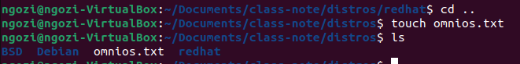

# Chapter 5
## Part 1

1. Open a terminal, cd to the Documents directory. Issue the pwd command to find your present working directory (or current location).

2. In the Documents directory, use the mkdir command to create a directory named: class-notes

3. cd into the class-notes directory. Issue the command to show your present working directory.

4. Create the a directory named distros in the class-notes directory. Once created take a screen shot of the output of the ls command in the distros directory

5. Under the distros directory create a directory named: BSD

6. Under the distros directory create a directory named: Debian

7. Under the distros directory create a directory named: redhat

8. In the directory BSD use the command to create a file: Create three files names: oracle-linux.txt, openbsd.txt, and netbsd.txt

9. In the directory Debian use the command to create a file: Create three three names: ubuntu.txt, freebsd.txt, and xubuntu.txt

10. In the directory redhat use the command to create a file: Create three files names: fedora.txt, rhel.txt, and debian.txt

11. cd to the distro directory and create a file named: omnios.txt

12. In the text files created you will notice that a few of them are out of place, such as debian.txt is in the redhat folder. Issue the command to move the text files to the correct locations and show a directory listing before and after the move command. (Hint: ls mv ls)

13. Use the mv command to rename the redhat directory to have an uppercase "R"

14. Use the rm command to delete the oracle-linux.txt file

15. Use the mkdir command to create a directory in the distros directory named: illumos and move the omnios.txt file into the illumos directory

16. What would be the command to cd from your current location to the relative path of ./distros/BSD directory using a relative path?

17. What would be the command to change directory from your current location to the Redhat directory using a relative path?

18. What would be the command to change directory to your HOME directory using the relative path?

19. What would be the command to change directory from your HOME directory to the debian directory using a relative path?

What would be the command, using an absolute path to change from your current directory to the /etc/ssh/ directory?

# Part 2