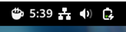
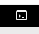
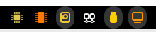
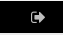
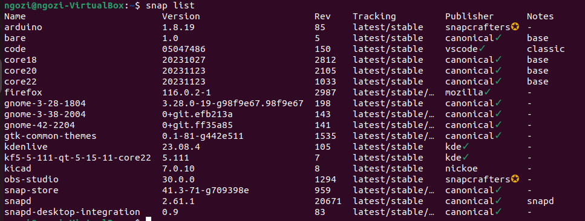
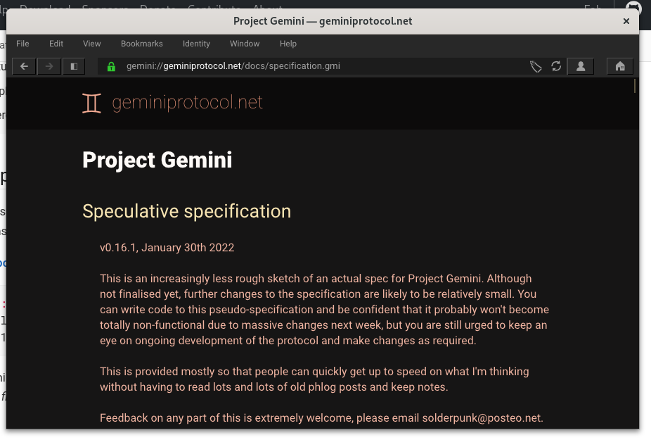
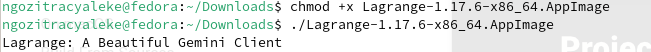
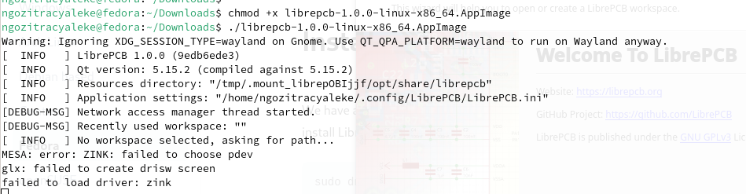
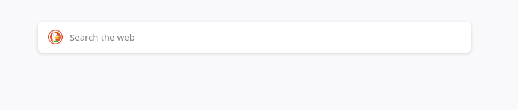
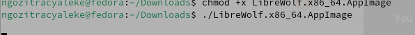

## Caffeine
The Caffeine Icon is used to disable the screensaver and auto suspend it.

## Drop Down Terminal

The Drop-Down Terminal enables access to the terminal from the desktop.

## System Monitor

The system monitors display resources usage.

## Logout Button

The log out button – this adds logout button to the panel for easy access.

## Ubuntu Snap install

# Appimage Install

## Lagrange

## LibrePCB

## Librewolf

