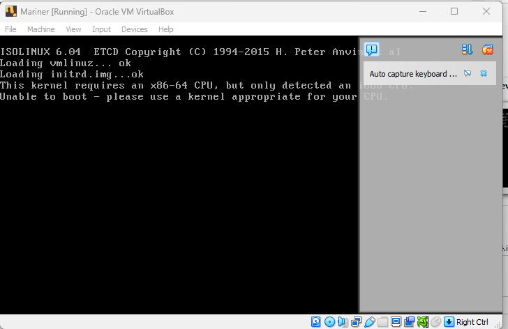

## screenshot for Almalinux

## screenshot for archlinux

## screenshot for debian12

## Screenshot for Lubuntu

## Screenshot for PopOS

## Screenshot for Ubuntu

## Screenshot for Xubuntu

## Screenshot for Trisquel

## Screenshot for Fedora

## Screenshot for pureOS

## Screenshot for Ubuntu Server

## Screenshot for Xebian

## Screenshot for OpenSUSE

## Screenshot for NeonUser

## Screenshot for MarinerOS
 

## Screenshot for FreeBSD
